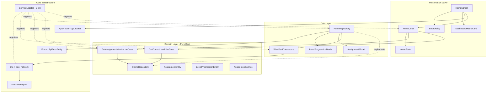
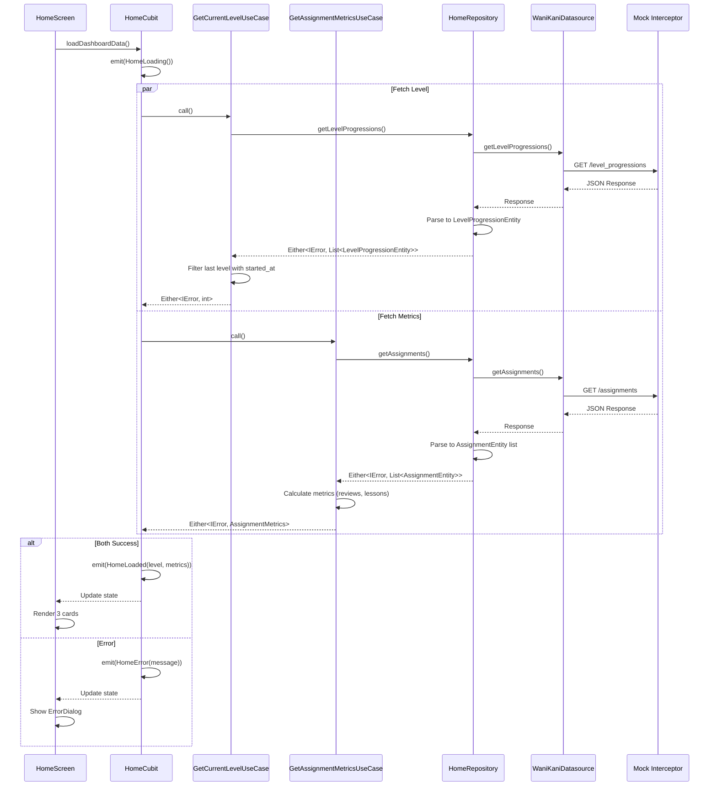
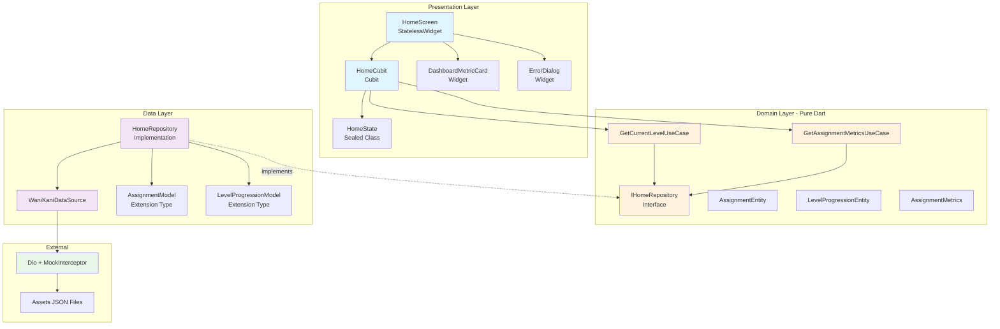
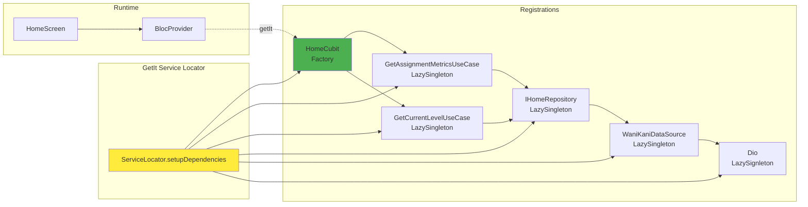

# Architecture: Feature Home/Dashboard - MVP

> **Feature Branch:** `feature/home-dashboard`  
> **Data:** 11/10/2025  
> **Context:** [context.md](context.md)

---

## 📋 Índice

1. [Visão Geral do Sistema](#-visão-geral-do-sistema)
2. [Componentes e Dependências](#-componentes-e-dependências)
3. [Padrões e Melhores Práticas](#-padrões-e-melhores-práticas)
4. [Dependências Externas](#-dependências-externas)
5. [Restrições e Suposições](#-restrições-e-suposições)
6. [Trade-offs e Alternativas](#-trade-offs-e-alternativas)
7. [Arquivos a Criar/Editar](#-arquivos-a-criareditar)
8. [Diagramas](#-diagramas)

---

## 🏗️ Visão Geral do Sistema

### Estado Atual (Antes)

```
lib/
├── core/
│   ├── error/              # ✅ IError, ApiErrorEntity, InternalErrorEntity
│   ├── mixins/             # ✅ DecodeModelMixin
│   └── strings/            # ✅ Existe
├── home/                   # 🔶 Estrutura vazia
│   ├── data/
│   ├── domain/
│   └── presentation/
├── routing/                # ❌ Vazio
├── config/                 # ❌ Vazio
├── main.dart               # 🔶 App padrão Flutter
└── main_mock.dart          # ❌ Vazio
```

**Problemas:**
- ❌ Sem navegação configurada
- ❌ Sem dependency injection
- ❌ Sem networking configurado
- ❌ Feature home vazia

### Estado Alvo (Depois)

```
lib/
├── core/
│   ├── di/
│   │   └── service_locator.dart            # ✨ GetIt setup
│   ├── error/                               # ✅ Já existe
│   ├── mixins/                              # ✅ Já existe
│   ├── network/
│   │   └── interceptors/
│   │       └── mock_interceptor.dart       # ✨ Mock para desenvolvimento
│   └── strings/                             # ✅ Já existe
├── features/
│   └── home/
│       ├── data/
│       │   ├── datasources/
│       │   │   └── wanikani_datasource.dart          # ✨ API calls
│       │   ├── models/
│       │   │   ├── assignment_model.dart             # ✨ Extension type
│       │   │   └── level_progression_model.dart      # ✨ Extension type
│       │   └── repositories/
│       │       └── home_repository.dart              # ✨ Implementação
│       ├── domain/
│       │   ├── entities/
│       │   │   ├── assignment_entity.dart            # ✨ Pure Dart
│       │   │   ├── level_progression_entity.dart     # ✨ Pure Dart
│       │   │   └── assignment_metrics.dart           # ✨ Agregado
│       │   ├── repositories/
│       │   │   └── i_home_repository.dart            # ✨ Interface
│       │   └── usecases/
│       │       ├── get_current_level_usecase.dart    # ✨ Use case
│       │       └── get_assignment_metrics_usecase.dart # ✨ Use case
│       └── presentation/
│           ├── cubits/
│           │   ├── home_cubit.dart                   # ✨ Cubit
│           │   └── home_state.dart                   # ✨ States
│           ├── screens/
│           │   └── home_screen.dart                  # ✨ UI
│           └── widgets/
│               ├── dashboard_metric_card.dart        # ✨ Component
│               └── error_dialog.dart                 # ✨ Component
│       └── utils/
│           └── home_strings.dart                     # ✨ Strings centralizadas
├── routing/
│   └── app_router.dart                      # ✨ go_router config
├── main.dart                                 # 🔄 Atualizar
└── main_mock.dart                            # 🔄 Criar
```

**Melhorias:**
- ✅ Navegação com go_router
- ✅ DI com GetIt
- ✅ Networking com Dio + pop_network
- ✅ Feature home completa (TDD)
- ✅ Mock interceptor funcional

---

## 🧩 Componentes e Dependências

### Diagrama de Componentes



### Fluxo de Dados



---

## 📐 Padrões e Melhores Práticas

### 1. Clean Architecture - Separação Estrita

**Domain Layer (Pure Dart):**
```dart
// ✅ PERMITIDO
import 'package:dartz/dartz.dart';
import 'package:equatable/equatable.dart';

// ❌ PROIBIDO
import 'package:flutter/material.dart';
import 'package:dio/dio.dart';
```

**Regras:**
- Entities sem dependências externas
- Repository interfaces (não implementações)
- Use cases orquestram lógica de negócio
- Retorno sempre `Either<IError, T>`

### 2. Extension Types para Models (Dart 3.0+)

```dart
// Zero-cost abstraction
extension type AssignmentModel(AssignmentEntity entity) 
    implements AssignmentEntity {
  
  AssignmentModel.fromJson(Map<String, dynamic> json)
      : entity = AssignmentEntity(
          id: json['id'] as int,
          // ...
        );
  
  Map<String, dynamic> toJson() => {
        'id': id,
        // ...
      };
}
```

**Vantagens:**
- Sem overhead de wrapper class
- Type safety completo
- Implementa entity diretamente

### 3. Sealed Classes para States (Dart 3.0+)

```dart
sealed class HomeState extends Equatable {
  const HomeState();
  @override
  List<Object?> get props => [];
}

final class HomeInitial extends HomeState {}
final class HomeLoading extends HomeState {}
final class HomeError extends HomeState {
  final String message;
  const HomeError(this.message);
  @override
  List<Object> get props => [message];
}
final class HomeLoaded extends HomeState {
  final int currentLevel;
  final AssignmentMetrics metrics;
  
  const HomeLoaded({
    required this.currentLevel,
    required this.metrics,
  });
  
  @override
  List<Object> get props => [currentLevel, metrics];
}
```

**Vantagens:**
- Exhaustiveness checking no switch
- Impossible states impossible
- Pattern matching seguro

### 4. Switch Expressions para State Handling

```dart
// Importar strings da feature
import 'package:wanikani_app/features/home/utils/home_strings.dart';

builder: (context, state) => switch (state) {
  HomeInitial() => const SizedBox.shrink(),
  HomeLoading() => const Center(
    child: CircularProgressIndicator(),
  ),
  HomeError(:final message) => Center(
    child: Text(message), // Mensagem vem do state, não hardcoded
  ),
  HomeLoaded(:final currentLevel, :final metrics) => Column(
    children: [
      DashboardMetricCard(
        title: HomeStrings.levelLabel,
        value: currentLevel.toString(),
      ),
      DashboardMetricCard(
        title: HomeStrings.reviewsLabel,
        value: metrics.reviewCount.toString(),
      ),
      DashboardMetricCard(
        title: HomeStrings.lessonsLabel,
        value: metrics.lessonCount.toString(),
      ),
    ],
  ),
}
```

### 5. Dependency Injection com GetIt

**Padrão de Registro:**
```dart
void setupDependencies() {
  // 1. External (Dio)
  getIt.registerLazySingleton<Dio>(() => Dio(BaseOptions(
    baseUrl: '', // Vazio em mock mode
  ))..interceptors.add(MockInterceptor()));
  
  // 2. Datasources
  getIt.registerLazySingleton<WaniKaniDataSource>(
    () => WaniKaniDataSource(dio: getIt()),
  );
  
  // 3. Repositories (interface + implementação)
  getIt.registerLazySingleton<IHomeRepository>(
    () => HomeRepository(datasource: getIt()),
  );
  
  // 4. Use Cases
  getIt.registerLazySingleton<GetCurrentLevelUseCase>(
    () => GetCurrentLevelUseCase(repository: getIt()),
  );
  getIt.registerLazySingleton<GetAssignmentMetricsUseCase>(
    () => GetAssignmentMetricsUseCase(repository: getIt()),
  );
  
  // 5. Cubits (factory para instâncias novas)
  getIt.registerFactory<HomeCubit>(
    () => HomeCubit(
      getCurrentLevel: getIt(),
      getAssignmentMetrics: getIt(),
    ),
  );
}
```

**Uso na UI:**
```dart
BlocProvider(
  create: (_) => getIt<HomeCubit>()..loadDashboardData(),
  child: const HomeScreen(),
)
```

### 6. Error Handling com Either Monad

**Repository:**
```dart
@override
Future<Either<IError, List<AssignmentEntity>>> getAssignments() async {
  try {
    final Response<dynamic> response = await _datasource.getAssignments();
    
    if (response.statusCode == 200) {
      final List<AssignmentEntity> assignments =
          (response.data['data'] as List<dynamic>)
              .map((dynamic json) => AssignmentModel.fromJson(json))
              .toList();
      return Right(assignments);
    }
    
    return Left(ApiErrorEntity(
      response.data['error'] ?? 'Erro desconhecido',
      statusCode: response.statusCode,
    ));
  } catch (e) {
    return Left(InternalErrorEntity(e.toString()));
  }
}
```

**Use Case:**
```dart
Future<Either<IError, int>> call() async {
  final Either<IError, List<LevelProgressionEntity>> result =
      await _repository.getLevelProgressions();
  
  return result.fold(
    (IError error) => Left(error),
    (List<LevelProgressionEntity> levels) {
      final LevelProgressionEntity current = levels
          .where((LevelProgressionEntity l) => l.startedAt != null)
          .reduce((LevelProgressionEntity a, LevelProgressionEntity b) =>
              a.level > b.level ? a : b);
      return Right(current.level);
    },
  );
}
```

**Cubit:**
```dart
// Importar strings no topo do arquivo
import 'package:wanikani_app/features/home/utils/home_strings.dart';

Future<void> loadDashboardData() async {
  emit(const HomeLoading());
  
  final Either<IError, int> levelResult = await _getCurrentLevel();
  final Either<IError, AssignmentMetrics> metricsResult =
      await _getAssignmentMetrics();
  
  if (levelResult.isLeft() || metricsResult.isLeft()) {
    final String message = levelResult.fold(
      (IError e) => e.message,
      (_) => metricsResult.fold(
        (IError e) => e.message,
        (_) => HomeStrings.unknownError, // ✅ Usando constante
      ),
    );
    emit(HomeError(message));
    return;
  }
  
  final int level = levelResult.getOrElse(() => 0);
  final AssignmentMetrics metrics =
      metricsResult.getOrElse(() => const AssignmentMetrics(
            reviewCount: 0,
            lessonCount: 0,
          ));
  
  emit(HomeLoaded(currentLevel: level, metrics: metrics));
}
```

### 7. Mock Interceptor Pattern

```dart
class MockInterceptor extends Interceptor {
  @override
  void onRequest(
    RequestOptions options,
    RequestInterceptorHandler handler,
  ) async {
    // Determinar qual mock usar baseado no path
    final String mockPath = _getMockPath(options.path);
    
    try {
      // Ler JSON do asset
      final String jsonString =
          await rootBundle.loadString('assets/mock/$mockPath.json');
      final Map<String, dynamic> data =
          jsonDecode(jsonString) as Map<String, dynamic>;
      
      // Simular delay de rede
      await Future<void>.delayed(const Duration(milliseconds: 500));
      
      // Resolver com mock response
      handler.resolve(Response<Map<String, dynamic>>(
        requestOptions: options,
        data: data,
        statusCode: 200,
      ));
    } catch (e) {
      handler.reject(DioException(
        requestOptions: options,
        error: 'Mock not found: $mockPath',
      ));
    }
  }
  
  String _getMockPath(String path) {
    if (path.contains('level_progressions')) {
      return 'all_level_progression';
    }
    if (path.contains('assignments')) {
      return 'all_assignments';
    }
    return 'unknown';
  }
}
```

### 8. Strings Centralizadas por Feature

**Regra Crítica:** ❌ NUNCA colocar strings hardcoded diretamente nas telas/widgets.

**Padrão:**
```dart
// lib/features/home/utils/home_strings.dart
class HomeStrings {
  static const String appBarTitle = 'WaniKani';
  static const String levelLabel = 'Nível';
  static const String reviewsLabel = 'Reviews';
  static const String lessonsLabel = 'Lessons';
  static const String errorTitle = 'Erro';
  static const String errorMessage = 'Não foi possível carregar os dados';
  static const String retryButton = 'Tentar Novamente';
  static const String loadingMessage = 'Carregando...';
  static const String unknownError = 'Erro desconhecido';
}
```

**Uso nas Telas:**
```dart
// ✅ CORRETO
AppBar(
  title: Text(HomeStrings.appBarTitle),
)

DashboardMetricCard(
  title: HomeStrings.levelLabel,
  value: currentLevel.toString(),
)

// ❌ ERRADO
AppBar(
  title: const Text('WaniKani'), // Hardcoded!
)
```

**Localização:**
- Arquivo: `lib/features/<feature>/utils/<feature>_strings.dart`
- Exemplo: `lib/features/home/utils/home_strings.dart`
- Classe: `<Feature>Strings` (ex: `HomeStrings`, `DashboardStrings`)
- Campos: `static const String`

**Justificativa:**
- ✅ Facilita i18n futura
- ✅ Manutenção centralizada
- ✅ Encontrar textos facilmente
- ✅ Evita duplicação

### 9. TDD - Ordem de Desenvolvimento

```
1. DOMAIN LAYER (Test First)
   ├─ test/features/home/domain/entities/assignment_entity_test.dart
   ├─ lib/features/home/domain/entities/assignment_entity.dart
   ├─ test/features/home/domain/usecases/get_current_level_usecase_test.dart
   └─ lib/features/home/domain/usecases/get_current_level_usecase.dart

2. DATA LAYER (Test First)
   ├─ test/features/home/data/models/assignment_model_test.dart
   ├─ lib/features/home/data/models/assignment_model.dart
   ├─ test/features/home/data/repositories/home_repository_test.dart
   └─ lib/features/home/data/repositories/home_repository.dart

3. PRESENTATION LAYER (Test First)
   ├─ test/features/home/presentation/cubits/home_cubit_test.dart
   └─ lib/features/home/presentation/cubits/home_cubit.dart
```

---

## 📦 Dependências Externas

### Biblioteca: pop_network

**Análise da Documentação (https://pub.dev/packages/pop_network):**

Após revisar a documentação, `pop_network` é um wrapper sobre Dio que fornece:
- Gestão simplificada de requests
- Interceptors pré-configurados
- Error handling estruturado

**Decisão de Uso:**
Vamos usar `pop_network` **minimamente** para não adicionar complexidade desnecessária nesta primeira feature. Posteriormente, se necessário, podemos adotar mais funcionalidades.

**Configuração Básica:**
```dart
// Usar Dio diretamente (pop_network já está no pubspec)
final dio = Dio(BaseOptions(
  baseUrl: '', // Vazio em mock
));
```

**Justificativa:**
- MVP deve ser simples
- Dio puro é suficiente para este estágio
- pop_network pode ser integrado em features futuras

### Adições Necessárias no pubspec.yaml

```yaml
dependencies:
  # Já existentes - OK
  
dev_dependencies:
  mocktail: ^1.0.0  # ✨ ADICIONAR (em vez de mockito)
```

**Mudança:** Trocar `mockito` por `mocktail` conforme padrões do projeto.

---

## 🚧 Restrições e Suposições

### Restrições

1. **Sem Cache/Persistência**
   - Drift NÃO será usado nesta fase
   - Todas as requisições vão direto ao datasource
   - Sem tratamento de dados offline

2. **Token Hardcoded**
   - Token da API WaniKani hardcoded no código
   - SEM `flutter_secure_storage`
   - SEM tela de autenticação

3. **Mock Development Only**
   - Desenvolvimento 100% em modo mock
   - Interceptor lê JSONs de `assets/mock/`
   - API real não será testada nesta fase

4. **Sem Paginação**
   - API retorna até 500 items por página
   - Assumir que 500 é suficiente para MVP
   - Não implementar lógica de paginação

### Suposições

1. **JSONs Mockados Estão Corretos**
   - `assets/mock/all_assignments.json` está válido
   - `assets/mock/all_level_progression.json` está válido
   - Estrutura corresponde à API real

2. **Dart 3.0+ Features**
   - Extension types disponíveis
   - Sealed classes disponíveis
   - Switch expressions disponíveis

3. **go_router Configuração Simples**
   - Uma única rota inicial
   - Sem guards/redirecionamentos
   - Sem deep linking

4. **GetIt Global Instance**
   - `getIt` é global (singleton)
   - Inicializado no `main()`
   - Sem scoping/hierarquia

---

## ⚖️ Trade-offs e Alternativas

### 1. Extension Types vs Classes Wrapper

**Decisão:** Extension Types

**Alternativa Rejeitada:**
```dart
class AssignmentModel {
  final AssignmentEntity entity;
  AssignmentModel(this.entity);
  
  factory AssignmentModel.fromJson(Map<String, dynamic> json) {
    return AssignmentModel(AssignmentEntity(/*...*/));
  }
}
```

**Trade-off:**
- ✅ Extension types: zero overhead, type safety
- ❌ Wrapper class: overhead de memória, menos ergonômico
- ⚠️ Extension types: feature nova (Dart 3.0+)

**Justificativa:** Performance e ergonomia superam risco de feature nova.

### 2. Dois Use Cases vs Um UseCase Agregador

**Decisão:** Dois Use Cases Separados

**Regra do Projeto:** 1 use case por endpoint HTTP

**Alternativa Rejeitada:**
```dart
class GetDashboardDataUseCase {
  Future<Either<IError, DashboardData>> call() {
    // Chama ambos endpoints internamente
  }
}
```

**Trade-off:**
- ✅ Separado: segue regra do projeto, granularidade
- ❌ Agregado: menos código, mais conveniente
- ⚠️ Separado: cubit precisa orquestrar

**Justificativa:** Consistência arquitetural é mais importante que conveniência.

### 3. Cubit Combina Results vs Use Case Combina

**Decisão:** Cubit combina (lógica na presentation)

**Alternativa Rejeitada:**
```dart
// Use case que internamente chama outros use cases
class GetDashboardDataUseCase {
  final GetCurrentLevelUseCase _getLevel;
  final GetAssignmentMetricsUseCase _getMetrics;
  
  Future<Either<IError, DashboardData>> call() async {
    final level = await _getLevel();
    final metrics = await _getMetrics();
    // Combina resultados
  }
}
```

**Trade-off:**
- ✅ Cubit combina: separação clara de responsabilidades
- ❌ UseCase combina: viola regra de 1 use case = 1 endpoint
- ⚠️ Cubit combina: mais código no cubit

**Justificativa:** Regra arquitetural não deve ser violada. Cubit pode orquestrar.

### 4. mocktail vs mockito

**Decisão:** mocktail

**Alternativa Rejeitada:** mockito (atualmente no pubspec)

**Trade-off:**
- ✅ mocktail: sem code generation, mais simples
- ❌ mockito: requer build_runner, mais verboso
- ⚠️ mocktail: menos maduro

**Justificativa:** Padrão do projeto conforme `CLAUDE.meta.md`.

### 5. Dio Puro vs pop_network Completo

**Decisão:** Dio puro (usar pop_network minimamente)

**Alternativa Considerada:** Usar todas features do pop_network

**Trade-off:**
- ✅ Dio puro: simplicidade, controle total
- ❌ pop_network completo: features prontas mas learning curve
- ⚠️ Dio puro: pode precisar refatorar depois

**Justificativa:** MVP deve ser o mais simples possível. Adicionar pop_network features conforme necessário.

### 6. States com Metrics Entity vs Valores Separados

**Decisão:** State com `AssignmentMetrics` entity

**Alternativa Rejeitada:**
```dart
final class HomeLoaded extends HomeState {
  final int currentLevel;
  final int reviewCount;
  final int lessonCount;
}
```

**Trade-off:**
- ✅ Com entity: consistência (use case retorna entity)
- ❌ Valores separados: mais flat, menos aninhamento
- ⚠️ Com entity: um nível extra de acesso (`state.metrics.reviewCount`)

**Justificativa:** Consistência com domain layer (use case retorna `AssignmentMetrics`).

---

## 📁 Arquivos a Criar/Editar

### Criar (Total: 24 arquivos de produção + 8 de teste)

#### Core Infrastructure (4 arquivos)

1. `lib/core/di/service_locator.dart`
   - Setup GetIt
   - Registrar todas as dependências

2. `lib/core/network/interceptors/mock_interceptor.dart`
   - Interceptor Dio para mock
   - Ler JSONs de assets

3. `lib/routing/app_router.dart`
   - Configuração go_router
   - Rota `/` → HomeScreen

4. `lib/main_mock.dart`
   - Entrypoint desenvolvimento
   - Inicializar DI + router

#### Feature Home - Domain (6 arquivos)

5. `lib/features/home/domain/entities/assignment_entity.dart`
6. `lib/features/home/domain/entities/level_progression_entity.dart`
7. `lib/features/home/domain/entities/assignment_metrics.dart`
8. `lib/features/home/domain/repositories/i_home_repository.dart`
9. `lib/features/home/domain/usecases/get_current_level_usecase.dart`
10. `lib/features/home/domain/usecases/get_assignment_metrics_usecase.dart`

#### Feature Home - Data (4 arquivos)

11. `lib/features/home/data/models/assignment_model.dart`
12. `lib/features/home/data/models/level_progression_model.dart`
13. `lib/features/home/data/datasources/wanikani_datasource.dart`
14. `lib/features/home/data/repositories/home_repository.dart`

#### Feature Home - Presentation (5 arquivos)

15. `lib/features/home/presentation/cubits/home_state.dart`
16. `lib/features/home/presentation/cubits/home_cubit.dart`
17. `lib/features/home/presentation/screens/home_screen.dart`
18. `lib/features/home/presentation/widgets/dashboard_metric_card.dart`
19. `lib/features/home/presentation/widgets/error_dialog.dart`

#### Feature Home - Utils (1 arquivo)

20. `lib/features/home/utils/home_strings.dart`
   - Todas as strings usadas na feature
   - Labels, títulos, mensagens de erro

#### Tests (8 arquivos principais - TDD)

20. `test/features/home/data/models/assignment_model_test.dart`
21. `test/features/home/data/models/level_progression_model_test.dart`
22. `test/features/home/data/repositories/home_repository_test.dart`
23. `test/features/home/domain/usecases/get_current_level_usecase_test.dart`
24. `test/features/home/domain/usecases/get_assignment_metrics_usecase_test.dart`
25. `test/features/home/presentation/cubits/home_cubit_test.dart`
26. `test/core/network/interceptors/mock_interceptor_test.dart`
27. `test/helpers/test_helper.dart` (mocks reutilizáveis)

### Editar (3 arquivos)

28. `pubspec.yaml`
    - Adicionar `mocktail`
    - Configurar `assets/mock/` em flutter.assets

29. `lib/main.dart`
    - Integrar go_router
    - Inicializar GetIt

30. `lib/home/` (pasta existente)
    - **MOVER** para `lib/features/home/`
    - **APAGAR** pastas vazias (data/repositories, data/services)

### Deletar/Reorganizar

31. `lib/home/*` → Mover para `lib/features/home/`

---

## 📊 Diagramas

### Diagrama de Arquitetura em Camadas



### Diagrama de Dependency Injection



---

## ✅ Validação da Arquitetura

### Checklist de Conformidade

- [x] Segue Clean Architecture (domain/data/presentation)
- [x] Domain layer sem dependências Flutter
- [x] Repository interfaces com prefixo "I"
- [x] Um use case por endpoint HTTP
- [x] Extension types para models
- [x] Sealed classes para states
- [x] Either<IError, T> para error handling
- [x] GetIt para dependency injection
- [x] go_router para navegação
- [x] TDD: testes antes de implementação
- [x] Mock interceptor para desenvolvimento
- [x] Entities sem sufixo "Data"
- [x] Strings centralizadas em arquivo utils/<feature>_strings.dart
- [x] Sem strings hardcoded nas telas

### Riscos Identificados

| Risco | Probabilidade | Impacto | Mitigação |
|-------|--------------|---------|-----------|
| Extension types (Dart 3.0+) não suportados | Baixa | Alto | Verificar versão SDK no pubspec (^3.8.0) ✅ |
| JSONs mockados inválidos | Média | Médio | Validar estrutura antes de desenvolver |
| pop_network incompatível com Dio | Baixa | Médio | Usar Dio puro se necessário |
| GetIt registration order errado | Média | Alto | Registrar em ordem de dependências |
| go_router breaking changes | Baixa | Médio | Versão pinada no pubspec (^13.0.0) |

---

## 📝 Próximos Passos

1. ✅ **Revisão deste documento** pelo desenvolvedor
2. ⏭️ **Implementação TDD** seguindo ordem:
   - Fase 1: Setup (pubspec, DI, router, interceptor)
   - Fase 2: Domain (entities → interfaces → use cases)
   - Fase 3: Data (models → datasources → repositories)
   - Fase 4: Presentation (states → cubits → screens)
3. ⏭️ **Validação** com checklist de Done
4. ⏭️ **Code review** e ajustes finais

---

**Status:** 🟢 Arquitetura completa e pronta para implementação  
**Aprovação Necessária:** ✋ Aguardando revisão do desenvolvedor

