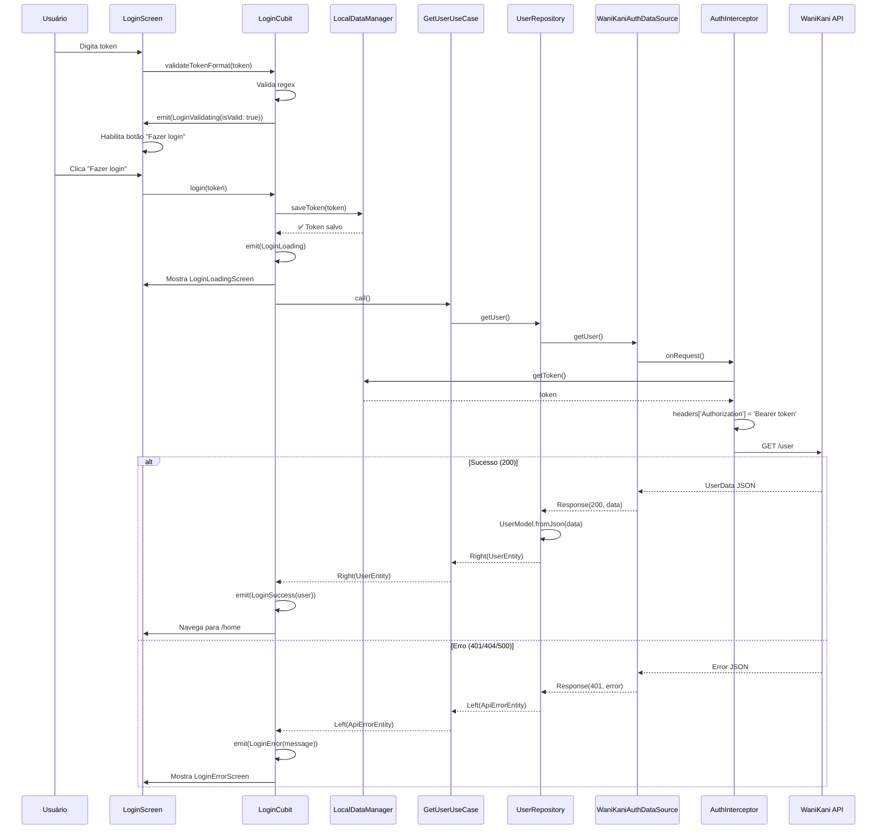
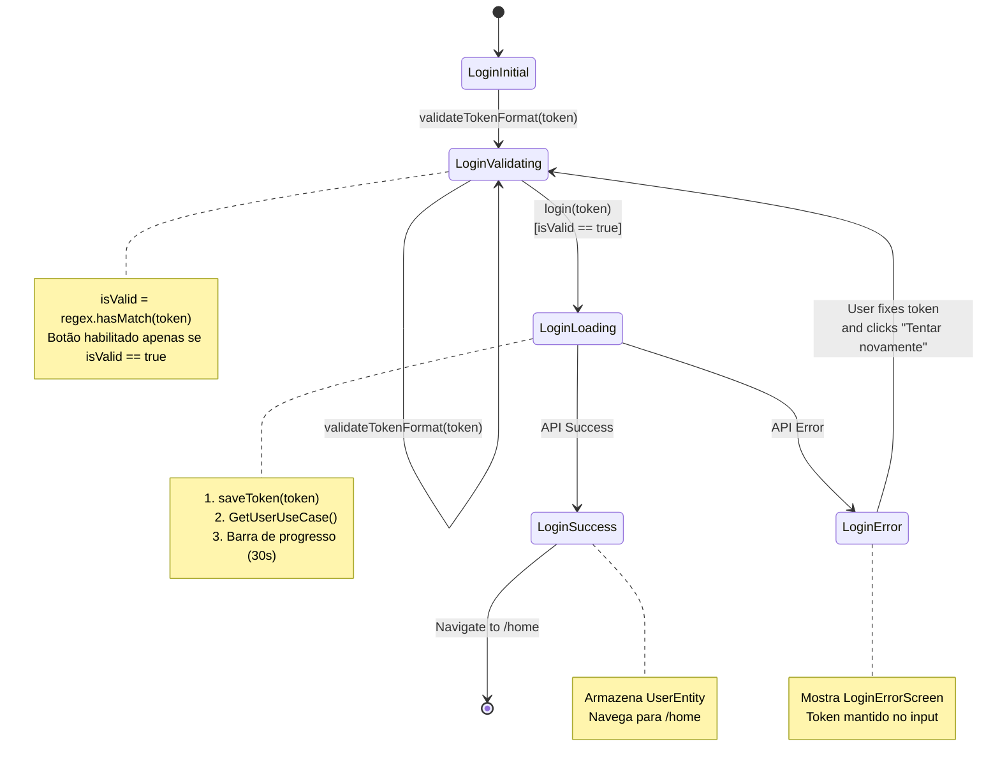

# Arquitetura: Feature de Login com Token API WaniKani

> **Data:** 26 de Outubro de 2025  
> **Branch:** feature/login  
> **Status:** Design Arquitetural

---

## 📋 Índice

1. [Visão Geral do Sistema](#visão-geral-do-sistema)
2. [Componentes Afetados](#componentes-afetados)
3. [Padrões e Melhores Práticas](#padrões-e-melhores-práticas)
4. [Dependências Externas](#dependências-externas)
5. [Restrições e Suposições](#restrições-e-suposições)
6. [Trade-offs e Alternativas](#trade-offs-e-alternativas)
7. [Consequências](#consequências)
8. [Arquivos a Serem Criados/Editados](#arquivos-a-serem-criadoseditados)
9. [Diagramas](#diagramas)

---

## 🏗️ Visão Geral do Sistema

### Estado Atual (Antes)

```
┌─────────────────────────────────────────────────┐
│ Main App                                        │
├─────────────────────────────────────────────────┤
│ • Token hardcoded em api_token.dart             │
│ • Dio configurado com header fixo               │
│ • Rota inicial sempre /home                     │
│ • Sem autenticação ou validação                 │
│ • Um único usuário (desenvolvedor)              │
└─────────────────────────────────────────────────┘
           ↓
┌─────────────────────────────────────────────────┐
│ core_di.dart                                    │
├─────────────────────────────────────────────────┤
│ Dio(                                            │
│   headers: {                                     │
│     'Authorization': apiToken  // ❌ HARDCODED   │
│   }                                              │
│ )                                                │
└─────────────────────────────────────────────────┘
```

### Estado Futuro (Depois)

```
┌─────────────────────────────────────────────────┐
│ Main App                                        │
├─────────────────────────────────────────────────┤
│ 1. Verifica token no LocalDataManager           │
│ 2. Define rota inicial (/login ou /home)        │
│ 3. Injeta dependências por demanda              │
└─────────────────────────────────────────────────┘
           ↓
      ┌────┴────┐
      │ Token? │
      └────┬────┘
   ┌───────┴───────┐
   ↓               ↓
┌──────┐     ┌─────────┐
│ SIM  │     │  NÃO    │
└──┬───┘     └────┬────┘
   │              │
   ↓              ↓
/home         /login
   │              │
   │         ┌────┴────────────────────────────┐
   │         │ LoginScreen                     │
   │         ├─────────────────────────────────┤
   │         │ • TokenTextField (máscara)      │
   │         │ • Validação regex tempo real    │
   │         │ • Tutorial bottom sheet         │
   │         │ • Versão do app no rodapé       │
   │         └────┬────────────────────────────┘
   │              │ ↓ Login
   │         ┌────┴────────────────────────────┐
   │         │ LoginLoadingScreen              │
   │         ├─────────────────────────────────┤
   │         │ • Barra de progresso (30s)      │
   │         └────┬─────┬──────────────────────┘
   │              │     │
   │         Sucesso  Erro
   │              │     │
   │              │     ↓
   │              │ LoginErrorScreen
   │              │     │
   │              │  Tentar
   │              │  Novamente
   │              ↓     ↓
   └──────────→ /home  (volta)
```

### Core: LocalDataManager + AuthInterceptor

```
┌─────────────────────────────────────────────────┐
│ core/storage/local_data_manager.dart           │
├─────────────────────────────────────────────────┤
│ FlutterSecureStorage                            │
│   • saveToken(String token)                     │
│   • getToken() → String?                        │
│   • deleteToken()                               │
│                                                  │
│ Key: 'wanikani_api_token'                       │
│ Encryption: AndroidEncryptedSharedPreferences   │
└─────────────────────────────────────────────────┘

┌─────────────────────────────────────────────────┐
│ core/network/interceptors/auth_interceptor.dart│
├─────────────────────────────────────────────────┤
│ onRequest():                                    │
│   1. token = LocalDataManager.getToken()       │
│   2. if token != null:                          │
│        headers['Authorization'] = 'Bearer $token'│
│                                                  │
│ onError():                                      │
│   if statusCode == 401:                         │
│     1. LocalDataManager.deleteToken()          │
│     2. Navigate to /login                       │
└─────────────────────────────────────────────────┘
```

---

## 🧩 Componentes Afetados

### 1. Core Layer (Infraestrutura Compartilhada)

#### ✅ Novos Componentes

**LocalDataManager** (`lib/core/storage/local_data_manager.dart`)
- **Responsabilidade:** Armazenamento seguro do token API
- **Dependência:** `flutter_secure_storage`
- **Compartilhado:** Usado por todas as features (login, logout futuro)
- **Registro:** `core_di.dart` (singleton)

**AuthInterceptor** (`lib/core/network/interceptors/auth_interceptor.dart`)
- **Responsabilidade:** Injetar header Authorization automaticamente
- **Dependência:** `LocalDataManager`
- **Posição:** Antes de `LoggingInterceptor` na cadeia
- **Registro:** `core_di.dart`

#### 🔄 Componentes Modificados

**core_di.dart**
- **Antes:** Header `Authorization` hardcoded no `BaseOptions`
- **Depois:** 
  - Remove header hardcoded
  - Registra `LocalDataManager` como singleton
  - Adiciona `AuthInterceptor` à cadeia de interceptors

```dart
// ANTES
Dio(
  BaseOptions(
    headers: {'Authorization': apiToken}, // ❌ Hardcoded
  ),
)

// DEPOIS
void setupCoreDependencies({required GetIt getIt, required bool useMock}) {
  // ✅ LocalDataManager compartilhado
  getIt.registerLazySingleton(() => LocalDataManager());
  
  if (!useMock) {
    getIt.registerLazySingleton<Dio>(
      () => Dio(
        BaseOptions(
          baseUrl: 'https://api.wanikani.com/v2',
          // ✅ Sem header hardcoded
        ),
      )
        ..interceptors.add(AuthInterceptor(getIt())) // ✅ NOVO
        ..interceptors.add(LoggingInterceptor(isMockMode: false)),
    );
  }
}
```

**MockInterceptor**
- **Modificação:** Adicionar rota `/user` para mock de autenticação

```dart
String? _getMockPath(String path) {
  if (path.contains('user')) return 'user'; // ✅ NOVO
  if (path.contains('level_progressions')) return 'all_level_progression';
  // ... existing routes
}
```

### 2. Routing Layer

#### 🔄 Componentes Modificados

**app_routes.dart**
```dart
enum AppRoutes {
  login('/login'),  // ✅ NOVO
  home('/'),
}
```

**app_router.dart**
- Adicionar rota `/login` com `BlocProvider`
- Modificar `initialLocation` para aceitar rota dinâmica

```dart
static GoRouter router({String? initialLocation}) => GoRouter(
  initialLocation: initialLocation ?? AppRoutes.home.path,
  routes: [
    GoRoute(
      path: AppRoutes.login.path,
      name: AppRoutes.login.name,
      builder: (context, state) => BlocProvider<LoginCubit>.value(
        value: getIt<LoginCubit>(),
        child: const LoginScreen(),
      ),
    ),
    // ... existing routes
  ],
);
```

**main.dart**
- Adicionar verificação de token antes de iniciar o app
- Passar rota inicial para `AppRouter.router()`

```dart
void main() async {
  WidgetsFlutterBinding.ensureInitialized();
  
  setupDependencies(useMock: false);
  
  // ✅ NOVO: Verificar token
  final localDataManager = getIt<LocalDataManager>();
  final token = await localDataManager.getToken();
  
  final initialRoute = token != null 
    ? AppRoutes.home.path 
    : AppRoutes.login.path;
  
  runApp(WaniKaniApp(initialRoute: initialRoute));
}

class WaniKaniApp extends StatelessWidget {
  final String initialRoute;
  
  const WaniKaniApp({required this.initialRoute, super.key});
  
  @override
  Widget build(BuildContext context) => MaterialApp.router(
    routerConfig: AppRouter.router(initialLocation: initialRoute),
    // ...
  );
}
```

### 3. Login Feature (Nova)

#### 📐 Arquitetura em Camadas

```
features/login/
├── domain/           # PURE DART (sem Flutter)
│   ├── entities/     # UserEntity, SubscriptionEntity
│   ├── repositories/ # IUserRepository (interface)
│   └── usecases/     # GetUserUseCase
│
├── data/             # Implementação + conversão JSON
│   ├── datasources/  # WaniKaniAuthDataSource
│   ├── models/       # UserModel, SubscriptionModel (extension types)
│   └── repositories/ # UserRepository (implements IUserRepository)
│
├── presentation/     # UI + State
│   ├── cubits/       # LoginCubit + LoginState (sealed)
│   ├── screens/      # LoginScreen, LoginLoadingScreen, LoginErrorScreen
│   └── widgets/      # TokenTextField, TutorialBottomSheet
│
└── login_di.dart     # Dependency Injection para feature
```

#### Domain Layer

**UserEntity**
```dart
class UserEntity extends Equatable {
  final String username;
  final DateTime startedAt;
  final int level;
  final SubscriptionEntity subscription;
  
  const UserEntity({...});
  
  @override
  List<Object> get props => [username, startedAt, level, subscription];
}
```

**SubscriptionEntity**
```dart
class SubscriptionEntity extends Equatable {
  final bool active;
  final String type;
  final DateTime? periodEndsAt;
  
  const SubscriptionEntity({...});
  
  @override
  List<Object?> get props => [active, type, periodEndsAt];
}
```

**IUserRepository**
```dart
abstract class IUserRepository {
  /// Busca informações do usuário da API WaniKani.
  ///
  /// Retorna [UserEntity] em caso de sucesso ou [IError] em caso de falha.
  Future<Either<IError, UserEntity>> getUser();
}
```

**GetUserUseCase**
```dart
class GetUserUseCase {
  final IUserRepository _repository;
  
  const GetUserUseCase({required IUserRepository repository})
    : _repository = repository;
  
  /// Busca dados do usuário autenticado.
  Future<Either<IError, UserEntity>> call() => _repository.getUser();
}
```

#### Data Layer

**UserModel + SubscriptionModel** (Extension Types)
```dart
extension type UserModel(UserEntity entity) implements UserEntity {
  UserModel.fromJson(Map<String, dynamic> json)
    : entity = UserEntity(
        username: json['data']['username'] as String,
        level: json['data']['level'] as int,
        startedAt: DateTime.parse(json['data']['started_at'] as String),
        subscription: SubscriptionModel.fromJson(
          json['data']['subscription'] as Map<String, dynamic>,
        ),
      );
  
  Map<String, dynamic> toJson() => {...};
}

extension type SubscriptionModel(SubscriptionEntity entity) 
    implements SubscriptionEntity {
  SubscriptionModel.fromJson(Map<String, dynamic> json)
    : entity = SubscriptionEntity(
        active: json['active'] as bool,
        type: json['type'] as String,
        periodEndsAt: json['period_ends_at'] != null
          ? DateTime.parse(json['period_ends_at'] as String)
          : null,
      );
  
  Map<String, dynamic> toJson() => {...};
}
```

**WaniKaniAuthDataSource**
```dart
class WaniKaniAuthDataSource {
  final Dio _dio;
  
  const WaniKaniAuthDataSource(this._dio);
  
  /// Busca informações do usuário.
  ///
  /// Endpoint: GET /user
  /// Header: Authorization (injetado automaticamente por AuthInterceptor)
  Future<Response<dynamic>> getUser() => _dio.get('/user');
}
```

**UserRepository**
```dart
class UserRepository with DecodeModelMixin implements IUserRepository {
  final WaniKaniAuthDataSource _datasource;
  
  const UserRepository({required WaniKaniAuthDataSource datasource})
    : _datasource = datasource;
  
  @override
  Future<Either<IError, UserEntity>> getUser() async {
    try {
      final response = await _datasource.getUser();
      
      if (response.isSuccessful) {
        return tryDecode<Either<IError, UserEntity>>(
          () {
            final user = UserModel.fromJson(
              response.data as Map<String, dynamic>,
            );
            return Right<IError, UserEntity>(user);
          },
          orElse: (_) => Left<IError, UserEntity>(
            InternalErrorEntity('Erro ao processar dados do usuário'),
          ),
        );
      }
      
      return Left<IError, UserEntity>(
        ApiErrorEntity(
          response.data?['error']?.toString() ?? 'Erro desconhecido',
          statusCode: response.statusCode,
        ),
      );
    } on Exception catch (e) {
      return Left<IError, UserEntity>(InternalErrorEntity(e.toString()));
    }
  }
}
```

#### Presentation Layer

**LoginState** (Sealed Class)
```dart
sealed class LoginState extends Equatable {
  const LoginState();
  @override
  List<Object?> get props => [];
}

final class LoginInitial extends LoginState {}

final class LoginValidating extends LoginState {
  final bool isValid;
  const LoginValidating({required this.isValid});
  @override
  List<Object> get props => [isValid];
}

final class LoginLoading extends LoginState {}

final class LoginSuccess extends LoginState {
  final UserEntity user;
  const LoginSuccess({required this.user});
  @override
  List<Object> get props => [user];
}

final class LoginError extends LoginState {
  final String message;
  const LoginError({required this.message});
  @override
  List<Object> get props => [message];
}
```

**LoginCubit**
```dart
class LoginCubit extends Cubit<LoginState> {
  final GetUserUseCase _getUserUseCase;
  final LocalDataManager _localDataManager;
  
  // Regex para validação do token
  static final _tokenRegex = RegExp(
    r'^[a-zA-Z0-9]{8}-[a-zA-Z0-9]{4}-[a-zA-Z0-9]{4}-[a-zA-Z0-9]{4}-[a-zA-Z0-9]{12}$',
  );
  
  LoginCubit({
    required GetUserUseCase getUserUseCase,
    required LocalDataManager localDataManager,
  }) : _getUserUseCase = getUserUseCase,
       _localDataManager = localDataManager,
       super(LoginInitial());
  
  /// Valida o formato do token em tempo real.
  void validateTokenFormat(String token) {
    final isValid = _tokenRegex.hasMatch(token);
    emit(LoginValidating(isValid: isValid));
  }
  
  /// Realiza o login: salva token → valida na API → navega.
  Future<void> login(String token) async {
    emit(LoginLoading());
    
    // 1. Salvar token localmente
    await _saveToken(token);
    
    // 2. Validar token chamando API
    final result = await _validateToken();
    
    // 3. Emitir estado com base no resultado
    result.fold(
      (error) => emit(LoginError(error.message)),
      (user) => emit(LoginSuccess(user)),
    );
  }
  
  /// Salva o token no storage seguro (método privado).
  Future<void> _saveToken(String token) async {
    await _localDataManager.saveToken(token);
  }
  
  /// Valida o token fazendo chamada à API (método privado).
  Future<Either<IError, UserEntity>> _validateToken() async {
    return await _getUserUseCase();
  }
}
```

**Princípios SOLID aplicados:**
- **Single Responsibility:** Cada método privado tem uma responsabilidade única
- **Separation of Concerns:** Métodos públicos orquestram, privados executam
- **Direct fold() usage:** Sempre usa fold() diretamente, nunca verifica isLeft() primeiro

**Widgets Customizados**

**TokenTextField**
```dart
class TokenTextField extends StatefulWidget {
  final TextEditingController controller;
  final ValueChanged<String> onChanged;
  
  const TokenTextField({
    required this.controller,
    required this.onChanged,
    super.key,
  });
  
  @override
  State<TokenTextField> createState() => _TokenTextFieldState();
}

class _TokenTextFieldState extends State<TokenTextField> {
  bool _obscureText = true;
  
  /// Aplica máscara: XXXXXXXX-XXXX-XXXX-XXXX-XXXXXXXXXXXX
  String _applyMask(String text) {
    final clean = text.replaceAll('-', '');
    if (clean.length > 36) return text;
    
    String masked = '';
    for (int i = 0; i < clean.length; i++) {
      if (i == 8 || i == 12 || i == 16 || i == 20) {
        masked += '-';
      }
      masked += clean[i];
    }
    return masked;
  }
  
  @override
  Widget build(BuildContext context) => TextField(
    controller: widget.controller,
    obscureText: _obscureText,
    style: WaniKaniTextStyles.body,
    decoration: InputDecoration(
      labelText: 'Token de API',
      labelStyle: WaniKaniTextStyles.caption,
      suffixIcon: IconButton(
        icon: Icon(_obscureText ? Icons.visibility : Icons.visibility_off),
        onPressed: () => setState(() => _obscureText = !_obscureText),
        color: WaniKaniColors.secondary,
      ),
    ),
    onChanged: (value) {
      final masked = _applyMask(value);
      if (masked != value) {
        widget.controller.value = TextEditingValue(
          text: masked,
          selection: TextSelection.collapsed(offset: masked.length),
        );
      }
      widget.onChanged(masked);
    },
  );
}
```

**TutorialBottomSheet**
```dart
class TutorialBottomSheet extends StatelessWidget {
  const TutorialBottomSheet({super.key});
  
  @override
  Widget build(BuildContext context) => Container(
    padding: EdgeInsets.all(WaniKaniDesign.spacingLg),
    decoration: BoxDecoration(
      color: WaniKaniColors.surface,
      borderRadius: BorderRadius.vertical(
        top: Radius.circular(WaniKaniDesign.radiusLarge),
      ),
    ),
    child: Column(
      mainAxisSize: MainAxisSize.min,
      crossAxisAlignment: CrossAxisAlignment.stretch,
      children: [
        // Drag handle
        Center(
          child: Container(
            width: 40,
            height: 4,
            decoration: BoxDecoration(
              color: WaniKaniColors.secondary,
              borderRadius: BorderRadius.circular(2),
            ),
          ),
        ),
        SizedBox(height: WaniKaniDesign.spacingLg),
        
        // Título
        Text(
          'Como conseguir um token do WaniKani?',
          style: WaniKaniTextStyles.h3,
        ),
        SizedBox(height: WaniKaniDesign.spacingMd),
        
        // Instruções
        Text(
          'Para conseguir um token de API do WaniKani, você deverá primeiro criar uma conta no site WaniKani, caso não tenha.',
          style: WaniKaniTextStyles.body,
        ),
        SizedBox(height: WaniKaniDesign.spacingSm),
        Text(
          'Após o login, entre no seu perfil pelo seu ícone de usuário, clique em API Tokens, caso não possua nenhum token ativo, gere um novo token com todas as permissões e copie o token.',
          style: WaniKaniTextStyles.body,
        ),
        SizedBox(height: WaniKaniDesign.spacingLg),
        
        // Botão primário
        ElevatedButton(
          onPressed: () async {
            await launchUrl(Uri.parse('https://www.wanikani.com'));
          },
          child: Text('Fazer login no WaniKani'),
        ),
        SizedBox(height: WaniKaniDesign.spacingSm),
        
        // Botão secundário
        OutlinedButton(
          onPressed: () => Navigator.pop(context),
          child: Text('Voltar para a tela de login'),
        ),
      ],
    ),
  );
}
```

---

## 📊 Padrões e Melhores Práticas

### 1. Clean Architecture (Mantido)

**Domain → Data → Presentation** (dependência unidirecional)

- ✅ Domain não conhece Data ou Presentation
- ✅ Data implementa interfaces do Domain
- ✅ Presentation usa UseCases do Domain

### 2. Extension Types para Models (Mantido)

```dart
// ✅ PADRÃO DO PROJETO (já usado em assignment_model.dart)
extension type UserModel(UserEntity entity) implements UserEntity {
  UserModel.fromJson(Map<String, dynamic> json) : entity = ...;
  Map<String, dynamic> toJson() => ...;
}
```

**Benefícios:**
- Zero-cost abstraction
- Type safety
- Sem overhead de wrapper class

### 3. Sealed Classes para Estados (Mantido)

```dart
// ✅ PADRÃO DO PROJETO (já usado em home_state.dart)
sealed class LoginState extends Equatable {
  const LoginState();
}

final class LoginInitial extends LoginState {}
final class LoginLoading extends LoginState {}
// ...
```

**Benefícios:**
- Exhaustiveness checking no switch
- Type safety
- IDE autocomplete

### 4. Either Monad para Error Handling (Mantido)

```dart
// ✅ PADRÃO DO PROJETO (dartz)
Future<Either<IError, UserEntity>> getUser() async {
  try {
    // ...
    return Right(user);
  } catch (e) {
    return Left(InternalErrorEntity(e.toString()));
  }
}

// Uso com fold()
result.fold(
  (error) => emit(LoginError(error.message)),
  (user) => emit(LoginSuccess(user)),
);
```

### 5. Dependency Injection com GetIt (Mantido)

```dart
// ✅ PADRÃO DO PROJETO
// Singleton para serviços compartilhados
getIt.registerLazySingleton(() => LocalDataManager());

// Factory para Cubits (nova instância cada vez)
getIt.registerFactory(() => LoginCubit(...));
```

### 6. Mixin DecodeModelMixin (Mantido)

```dart
// ✅ PADRÃO DO PROJETO (usado em home_repository.dart)
class UserRepository with DecodeModelMixin implements IUserRepository {
  @override
  Future<Either<IError, UserEntity>> getUser() async {
    return tryDecode<Either<IError, UserEntity>>(
      () {
        final user = UserModel.fromJson(response.data);
        return Right(user);
      },
      orElse: (_) => Left(InternalErrorEntity('...')),
    );
  }
}
```

### 7. Interceptor Chain Pattern (Novo mas consistente)

```dart
// ✅ SEGUINDO PADRÃO DE MockInterceptor e LoggingInterceptor
class AuthInterceptor extends Interceptor {
  final LocalDataManager _localDataManager;
  
  AuthInterceptor(this._localDataManager);
  
  @override
  Future<void> onRequest(
    RequestOptions options,
    RequestInterceptorHandler handler,
  ) async {
    final token = await _localDataManager.getToken();
    if (token != null) {
      options.headers['Authorization'] = 'Bearer $token';
    }
    handler.next(options);
  }
  
  @override
  void onError(DioException err, ErrorInterceptorHandler handler) {
    if (err.response?.statusCode == 401) {
      // Token inválido - limpar e redirecionar
      _localDataManager.deleteToken();
      // TODO: Navegar para /login usando navigation key
    }
    super.onError(err, handler);
  }
}
```

### 8. Widget Composition (Design System)

```dart
// ✅ USAR COMPONENTES EXISTENTES DO DESIGN SYSTEM
class LoginScreen extends StatelessWidget {
  @override
  Widget build(BuildContext context) => Scaffold(
    backgroundColor: WaniKaniColors.background, // ✅ Design System
    body: Padding(
      padding: EdgeInsets.all(WaniKaniDesign.spacingLg), // ✅ Tokens
      child: Column(
        children: [
          Text(
            'おかえり',
            style: WaniKaniTextStyles.h1, // ✅ Typography
          ),
          Text(
            'Por favor, insira seu token de API do WaniKani',
            style: WaniKaniTextStyles.body, // ✅ Typography
          ),
          TokenTextField(...),
          ElevatedButton(...), // ✅ Usa tema do WaniKaniTheme
        ],
      ),
    ),
  );
}
```

---

## 📦 Dependências Externas

### Novas Dependências (A Adicionar)

```yaml
dependencies:
  flutter_secure_storage: ^9.0.0
    # Armazenamento criptografado de tokens
    # Multiplataforma: Android (EncryptedSharedPreferences) + iOS (Keychain)
  
  url_launcher: ^6.2.0
    # Abrir URL externa (site WaniKani no browser)
  
  package_info_plus: ^5.0.0
    # Obter versão do app do pubspec.yaml
```

### Dependências Existentes (Já no Projeto)

```yaml
dependencies:
  flutter_bloc: ^9.1.1        # ✅ State management
  dartz: ^0.10.1              # ✅ Either monad
  dio: ^5.4.0                 # ✅ HTTP client
  go_router: ^13.0.0          # ✅ Navegação
  get_it: ^7.6.0              # ✅ Dependency injection
  equatable: ^2.0.5           # ✅ Value equality
  logger: ^2.0.2              # ✅ Logging
```

---

## 🚧 Restrições e Suposições

### Restrições Técnicas

1. **Flutter 3.0+ / Dart 3.0+**
   - Extension types requerem Dart 3.0+
   - Sealed classes requerem Dart 3.0+

2. **Formato do Token**
   - Fixo: `XXXXXXXX-XXXX-XXXX-XXXX-XXXXXXXXXXXX`
   - Apenas alfanuméricos ([a-zA-Z0-9])
   - Total: 36 caracteres + 4 traços = 40 caracteres

3. **Timeout da API**
   - 30 segundos (configurado no Dio)
   - Barra de progresso simula esse timeout

4. **Plataformas Suportadas**
   - Android: `EncryptedSharedPreferences`
   - iOS: `Keychain`
   - Outras plataformas: funcionalidade limitada

### Suposições

1. **Token não expira automaticamente**
   - WaniKani não invalida tokens periodicamente
   - Usuário deve revogar manualmente no site

2. **Internet necessária para login**
   - Não há validação offline do token
   - Requer chamada à API `/user`

3. **Um token por dispositivo**
   - Não há suporte a múltiplas contas
   - Um token = uma conta WaniKani

4. **Dados do usuário não são armazenados**
   - Apenas token é salvo
   - UserEntity usado apenas para validação
   - Cache de dados do usuário será implementado futuramente

---

## ⚖️ Trade-offs e Alternativas

### 1. Validação do Token

#### ✅ Decisão: Validação na API

**Prós:**
- Garante que token é válido e ativo
- Detecta tokens revogados
- Retorna dados do usuário (username, level)

**Contras:**
- Requer internet para login
- Latência de rede (até 30s timeout)
- Pode falhar por problemas de conectividade

#### ❌ Alternativa: Validação apenas local (regex)

**Prós:**
- Login instantâneo
- Funciona offline
- Sem latência

**Contras:**
- Não garante que token é válido
- Usuário só descobre erro ao fazer requisição
- Má UX (erro tardio)

**Justificativa:** Validação na API é mais segura e fornece melhor UX a longo prazo.

---

### 2. Armazenamento do Token

#### ✅ Decisão: flutter_secure_storage

**Prós:**
- Criptografia nativa (Keychain/EncryptedSharedPreferences)
- API simples e consistente
- Amplamente usado e testado

**Contras:**
- Dependência externa
- Tamanho do APK (+500KB)
- Compatibilidade limitada em plataformas não-mobile

#### ❌ Alternativa: shared_preferences com criptografia manual

**Prós:**
- Menos dependências
- Controle total da criptografia
- Funciona em todas as plataformas

**Contras:**
- Complexidade de implementação
- Risco de bugs de segurança
- Reinventar a roda

**Justificativa:** flutter_secure_storage é a solução padrão da comunidade e mais confiável.

---

### 3. Máscara do Token

#### ✅ Decisão: Implementação manual

**Prós:**
- Sem dependência extra
- Controle total do comportamento
- Código específico para o caso de uso

**Contras:**
- Mais código para manter
- Bugs potenciais de UX

#### ❌ Alternativa: mask_text_input_formatter

**Prós:**
- Biblioteca testada e madura
- Menos código
- Suporte a outros formatos

**Contras:**
- Dependência adicional (~100KB)
- Overhead para caso simples
- Flexibilidade desnecessária

**Justificativa:** Implementação manual é suficiente para um único formato fixo.

---

### 4. Barra de Progresso

#### ✅ Decisão: Progressão simulada (30s)

**Prós:**
- Feedback visual imediato
- Sensação de progresso
- Melhor UX durante espera

**Contras:**
- Não reflete progresso real
- Pode completar antes ou depois da API

#### ❌ Alternativa: Apenas loading spinner

**Prós:**
- Simples e honesto
- Sem ilusão de progresso

**Contras:**
- UX pobre em conexões lentas
- Usuário não sabe quanto tempo falta

**Justificativa:** Barra de progresso melhora percepção de velocidade (psicologia UX).

---

## 🎯 Consequências

### Positivas ✅

1. **Segurança Aprimorada**
   - Token não está mais hardcoded no código
   - Armazenamento criptografado
   - Cada usuário usa seu próprio token

2. **Flexibilidade**
   - Múltiplos usuários podem usar o app
   - Fácil trocar de conta (logout/login)
   - Base para features sociais futuras

3. **Manutenibilidade**
   - Clean Architecture facilita testes
   - Componentes bem separados
   - Padrões consistentes com o resto do projeto

4. **Escalabilidade**
   - LocalDataManager pode armazenar outros dados
   - AuthInterceptor pode adicionar outros headers
   - Base para refresh token futuro

5. **UX Melhorada**
   - Tutorial para novos usuários
   - Feedback visual (barra de progresso)
   - Mensagens de erro claras

### Negativas ⚠️

1. **Complexidade Aumentada**
   - 4 telas novas (Login, Loading, Error, Tutorial)
   - Mais estados para gerenciar
   - Mais código para testar

2. **Dependências Adicionais**
   - 3 novas bibliotecas (+~1MB no APK)
   - Maior superfície de ataque
   - Possíveis bugs de bibliotecas

3. **Requisito de Internet**
   - Usuário deve ter conexão para login inicial
   - Não funciona completamente offline
   - Possível frustração em áreas sem cobertura

4. **Manutenção do Token**
   - Usuário precisa saber onde conseguir token
   - Tutorial pode ficar desatualizado (mudanças no site)
   - Suporte adicional necessário

### Mitigações 🛡️

- **Complexidade:** Seguir padrões existentes, testes extensivos
- **Dependências:** Auditar bibliotecas, manter atualizadas
- **Internet:** Mensagem clara de erro, cache de dados pós-login
- **UX Token:** Tutorial atualizado, link direto para WaniKani

---

## 📁 Arquivos a Serem Criados/Editados

### ✅ Arquivos a CRIAR (19 novos)

#### Core (2 arquivos)
```
lib/core/
├── storage/
│   └── local_data_manager.dart          # ✅ NOVO
└── network/
    └── interceptors/
        └── auth_interceptor.dart         # ✅ NOVO
```

#### Feature Login (17 arquivos)
```
lib/features/login/
├── domain/
│   ├── entities/
│   │   ├── user_entity.dart              # ✅ NOVO
│   │   └── subscription_entity.dart      # ✅ NOVO
│   ├── repositories/
│   │   └── iuser_repository.dart         # ✅ NOVO
│   └── usecases/
│       └── get_user_usecase.dart         # ✅ NOVO
│
├── data/
│   ├── datasources/
│   │   └── wanikani_auth_datasource.dart # ✅ NOVO
│   ├── models/
│   │   ├── user_model.dart               # ✅ NOVO
│   │   └── subscription_model.dart       # ✅ NOVO
│   └── repositories/
│       └── user_repository.dart          # ✅ NOVO
│
├── presentation/
│   ├── cubits/
│   │   ├── login_cubit.dart              # ✅ NOVO
│   │   └── login_state.dart              # ✅ NOVO
│   ├── screens/
│   │   ├── login_screen.dart             # ✅ NOVO
│   │   ├── login_loading_screen.dart     # ✅ NOVO
│   │   └── login_error_screen.dart       # ✅ NOVO
│   └── widgets/
│       ├── token_text_field.dart         # ✅ NOVO
│       └── tutorial_bottom_sheet.dart    # ✅ NOVO
│
└── login_di.dart                          # ✅ NOVO
```

### 🔄 Arquivos a MODIFICAR (5 existentes)

```
lib/
├── core/
│   ├── dependency_injection/
│   │   └── core_di.dart                  # 🔄 MODIFICAR
│   └── network/
│       └── interceptors/
│           └── mock_interceptor.dart     # 🔄 MODIFICAR
├── routing/
│   ├── app_routes.dart                   # 🔄 MODIFICAR
│   └── app_router.dart                   # 🔄 MODIFICAR
├── main.dart                              # 🔄 MODIFICAR
└── main_mock.dart                         # 🔄 MODIFICAR (opcional)
```

### 📄 Arquivos de Configuração

```
pubspec.yaml                               # 🔄 MODIFICAR (adicionar dependências)
assets/mock/user.json                      # ✅ JÁ EXISTE (sem modificação)
```

---

## 📊 Diagramas

### 1. Fluxo de Autenticação (Sequence Diagram)



### 2. Arquitetura de Componentes (Component Diagram)

```mermaid
graph TB
    subgraph "Main App"
        MAIN[main.dart]
    end
    
    subgraph "Core Layer"
        LDM[LocalDataManager<br/>flutter_secure_storage]
        AI[AuthInterceptor<br/>Dio Interceptor]
        DIO[Dio Instance]
        
        LDM -.-> AI
        AI --> DIO
    end
    
    subgraph "Login Feature"
        direction TB
        
        subgraph "Presentation"
            LS[LoginScreen]
            LLS[LoginLoadingScreen]
            LES[LoginErrorScreen]
            LC[LoginCubit]
            
            LS --> LC
            LLS -.observa.-> LC
            LES -.observa.-> LC
        end
        
        subgraph "Domain"
            UE[UserEntity]
            UC[GetUserUseCase]
            IR[IUserRepository<br/>interface]
            
            UC --> IR
            UC --> UE
        end
        
        subgraph "Data"
            UR[UserRepository]
            UM[UserModel]
            DS[WaniKaniAuthDataSource]
            
            UR .implements.-> IR
            UR --> DS
            UR --> UM
            UM --> UE
            DS --> DIO
        end
        
        LC --> UC
        LC --> LDM
    end
    
    subgraph "Routing"
        AR[AppRouter<br/>go_router]
    end
    
    MAIN --> LDM
    MAIN --> AR
    AR --> LS
    
    DIO --> API[WaniKani API<br/>/user]
    
    style MAIN fill:#f9f,stroke:#333,stroke-width:2px
    style LDM fill:#9f9,stroke:#333,stroke-width:2px
    style AI fill:#9f9,stroke:#333,stroke-width:2px
    style LC fill:#99f,stroke:#333,stroke-width:2px
    style API fill:#ff9,stroke:#333,stroke-width:2px
```

### 3. Fluxo de Estados do LoginCubit (State Machine)



### 4. Hierarquia de Navegação (Navigation Flow)

```mermaid
graph LR
    START((App Start)) --> CHECK{Token<br/>existe?}
    
    CHECK -->|SIM| HOME[/home<br/>HomeScreen]
    CHECK -->|NÃO| LOGIN[/login<br/>LoginScreen]
    
    LOGIN --> TUTORIAL{{TutorialBottomSheet<br/>Modal}}
    TUTORIAL --> WANIKANI[fa:fa-external-link WaniKani.com<br/>Browser]
    TUTORIAL --> LOGIN
    
    LOGIN --> LOADING[LoginLoadingScreen<br/>Fullscreen]
    LOADING -->|API Success| HOME
    LOADING -->|API Error| ERROR[LoginErrorScreen<br/>Fullscreen]
    ERROR --> LOGIN
    
    HOME --> LOGOUT[Logout<br/>Feature Futura]
    LOGOUT --> LOGIN
    
    style START fill:#9f9,stroke:#333,stroke-width:2px
    style HOME fill:#99f,stroke:#333,stroke-width:2px
    style LOGIN fill:#f99,stroke:#333,stroke-width:2px
    style LOADING fill:#ff9,stroke:#333,stroke-width:2px
    style ERROR fill:#f66,stroke:#333,stroke-width:2px
    style TUTORIAL fill:#f9f,stroke:#333,stroke-dasharray: 5 5
    style WANIKANI fill:#9ff,stroke:#333,stroke-dasharray: 5 5
```

---

## 🎓 Próximos Passos

1. ✅ **Revisar este documento de arquitetura**
2. ⏭️ **Obter aprovação para prosseguir**
3. ⏭️ **Implementação:**
   - Fase 1: Core (LocalDataManager + AuthInterceptor)
   - Fase 2: Domain (Entities + Repository + UseCase)
   - Fase 3: Data (Models + DataSource + Repository impl)
   - Fase 4: Presentation (Cubit + Screens + Widgets)
   - Fase 5: Integração (Routing + DI + Main)
   - Fase 6: Testes (Unit + Widget)
4. ⏭️ **Validação e QA**

---

> **Documento preparado para revisão.** Aguardando aprovação para iniciar implementação.
